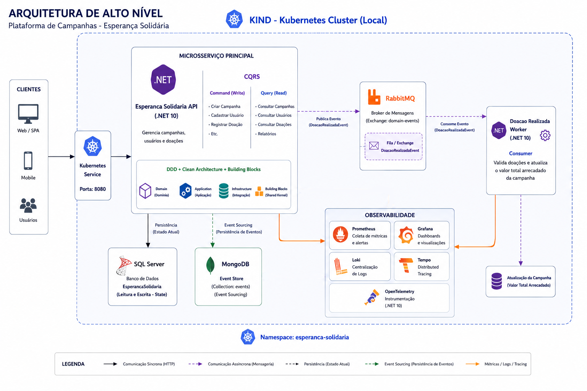

# EsperancaSolidaria

## 🎥 Apresentação do Projeto

Confira a apresentação completa do projeto no YouTube:

🔗 https://www.youtube.com/watch?v=ar1OfZhxDVY

## 📖 Descrição

EsperancaSolidaria é uma solução backend desenvolvida como projeto final do hackathon da pós-graduação em Arquitetura de Sistemas .NET da FIAP.

O sistema auxilia a ONG Esperança Solidária no gerenciamento de campanhas de arrecadação de fundos, processamento de doações e transparência financeira, implementando uma arquitetura modular orientada a eventos com foco em escalabilidade, observabilidade e boas práticas arquiteturais.

---

## 🔧 Configuração do Ambiente Local

Antes de executar a aplicação, é necessário configurar o ambiente Kubernetes local com Kind e instalar toda a infraestrutura da solução.

### Configuração do Cluster Kind

Documentação para criação e configuração do cluster Kubernetes local utilizando Kind:

```text
docs/configuracao-kind.md
```

### Configuração da Infraestrutura

Documentação completa para instalação da infraestrutura da aplicação:

- Prometheus
- Grafana
- Loki
- Tempo
- SQL Server
- MongoDB
- RabbitMQ
- API
- Worker

```text
docs/configuracao-infraestrutura.md
```

---

## 🏗️ Arquitetura

O projeto adota uma arquitetura modular orientada a eventos utilizando componentes desacoplados, padrões de arquitetura limpa, CQRS, Event Sourcing e processamento assíncrono.



### Componentes Principais

- **Building Blocks**
  - CQRS (Commands/Queries)
  - Domain Events
  - Event Sourcing
  - Messaging

- **Core**
  - **Domain** → Regras de negócio e entidades (`Campanha`, `Doacao`, `Usuario`)
  - **Application** → Handlers CQRS organizados por contexto limitado
  - **Infrastructure** → Persistência, mensageria e integração com serviços externos

- **Web**
  - API RESTful ASP.NET Core
  - Autenticação JWT
  - Swagger/OpenAPI
  - Health Checks
  - Métricas Prometheus

- **Workers**
  - Processamento assíncrono de eventos
  - Consumo de mensagens RabbitMQ
  - Atualização de campanhas

---

### Fluxo de Doação

1. Usuário autenticado cria uma doação via API
2. API persiste a doação no SQL Server
3. Evento `DoacaoRealizadaEvent` é publicado no RabbitMQ
4. Worker consome o evento
5. Campanha é atualizada
6. Logs, métricas e traces são enviados para a stack de observabilidade

---

## 🛠️ Tecnologias

### Backend

- .NET 10
- ASP.NET Core
- Entity Framework Core
- FluentValidation
- Serilog
- Polly

### Bancos de Dados

- SQL Server
- MongoDB

### Mensageria

- RabbitMQ

### Segurança

- JWT Bearer Authentication
- BCrypt

### Observabilidade

- OpenTelemetry
- Prometheus
- Grafana
- Loki
- Tempo

### DevOps & Infraestrutura

- Docker
- Kubernetes
- Kind
- Helm
- GitHub Actions

---

## 📁 Estrutura do Projeto

```text
src/
├── buildingblocks/EsperancaSolidaria.BuildingBlocks/     # Abstrações e modelos para CQRS, DDD, Eventos, Serializadores, etc.
│
├── core/
│   ├── EsperancaSolidaria.Application/                   # Handlers CQRS, Application Services
│   ├── EsperancaSolidaria.Domain/                        # Entidades, Eventos, Objetos de Domínio e Regras de Negócio
│   └── EsperancaSolidaria.Infrastructure/                # Persistência, Mensageria
│
├── web/
│   └── EsperancaSolidaria.API/                           # API Principal para gerenciamento de Usuários, Campanhas e Doações
│
└── workers/
    └── EsperancaSolidaria.Worker.DoacaoRealizada/        # Consumer para atualizar o valor total arrecadado da campanha

infra-as-code/
├── k8s/                                                  # Manifestos kubernetes para deploy nas pipelines de CD
└── kind/                                                 # Manifestos kubernetes para deploy da arquitetura

docs/                                                     # Documentação técnica e exemplos
```

---

## ▶️ Como Executar Localmente

### Subir com docker-compose os recursos necessários (Banco de dados e RabbitMQ)

```bash
dotnet compose up -d
```

### Restaurar dependências

```bash
dotnet restore
```

### Build da solução

```bash
dotnet build
```

### Executar API

```bash
dotnet run --project src/web/EsperancaSolidaria.API
```

### Executar Worker

```bash
dotnet run --project src/workers/EsperancaSolidaria.Worker.DoacaoRealizada
```
---

## ☸️ Kubernetes + Kind

Todos os serviços da aplicação executam em um cluster Kubernetes local utilizando Kind.

### Infraestrutura Utilizada

- SQL Server
- MongoDB
- RabbitMQ
- Prometheus
- Grafana
- Loki
- Tempo

### Componentes Kubernetes

- Deployments
- Services
- HPA
- ConfigMaps
- Secrets
- ServiceMonitor
- Namespaces

---

## 🔐 Segurança e Autorização

- Autenticação JWT
- Roles:
  - `GestorONG`
  - `Doador`
- Validações com FluentValidation
- Senhas criptografadas com BCrypt

---

## 📊 Observabilidade

A solução implementa observabilidade fim-a-fim utilizando OpenTelemetry e stack Grafana.

---

### Métricas

As métricas são exportadas no formato Prometheus através do endpoint:

```text
/metrics
```

### Métricas coletadas

- Requisições HTTP
- Tempo de resposta
- Throughput
- Uso de recursos
- Health checks

---

### Logs Centralizados

Os logs estruturados são enviados para o Grafana Loki utilizando Serilog.

### Características

- Logs estruturados em JSON
- Correlação distribuída
- Centralização via Loki
- Visualização no Grafana Explore

---

### Distributed Tracing

A aplicação utiliza OpenTelemetry + Grafana Tempo para tracing distribuído.

### Traces coletados

- Requisições HTTP
- Entity Framework Core
- SQL Server
- Exceptions
- Dependências externas

### Fluxo de tracing

```text
ASP.NET Core
    ↓
OpenTelemetry
    ↓
OTLP Exporter
    ↓
Grafana Tempo
```

---

## 📡 Stack de Observabilidade

| Ferramenta | Responsabilidade |
|---|---|
| Prometheus | Métricas |
| Grafana | Dashboards e visualização |
| Loki | Logs centralizados |
| Tempo | Distributed tracing |
| OpenTelemetry | Instrumentação |


---

## ⚙️ CI/CD

### Pipeline CI

Arquivo:

```text
pipeline-ci.yaml
```

Responsável por:

- Build
- Testes automatizados
- Versionamento semântico
- Build de imagens Docker

### Pipeline CD

Arquivo:

```text
pipeline-cd.yaml
```

Responsável por:

- Load de imagens no Kind
- Atualização de manifests Kubernetes
- Deploy automatizado

---

## 📚 Documentação

Consulte a pasta:

```text
docs/
```

Documentações disponíveis:

- Configuração do Kind
- Configuração da infraestrutura
- Diagrama da arquitetura da solução
- Exemplo de comandos do Entity Framework (EF Core)
- Requisitos do projeto da pós graduação
